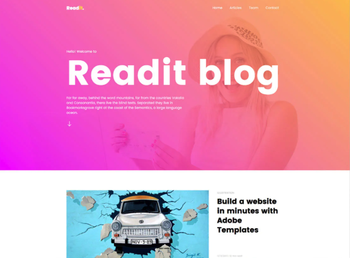

<h3 align="center">
  Desafio 1: Website em HTML5 e CSS3
</h3>

<blockquote align="center">“O segredo da mudança é concentrar toda a sua energia, não na luta contra o antigo, mas na construção do novo.” Dan Millman</blockquote>

  
  

  

  

## :computer:Sobre o desafio

### Objetivo:

Fazer o clone da página:

  

### Conhecimento em:

HTML5 e CSS3

### Informações sobre o desafio:

Clique para ver o <a href="https://github.com/Apollo-Group/Projeto-01-Template" target="_blank" rel="noopener noreferrer">
Template
</a> do desafio com as imagens do layout.

## :tada: Entrega

Copie a URL do repositório com o desafio e envie pela plataforma: http://platform.apollopartners.com.br

## :question: Dúvidas

Acesse o <a href="https://github.com/Apollo-Group/Projeto-FAQ">
FAQ
</a> ou abra uma issue nesse repositório que retornamos em breve.

## :clipboard: Licença

Esse projeto está sob a licença MIT. Veja o arquivo [LICENSE](LICENSE) para mais detalhes.

---
